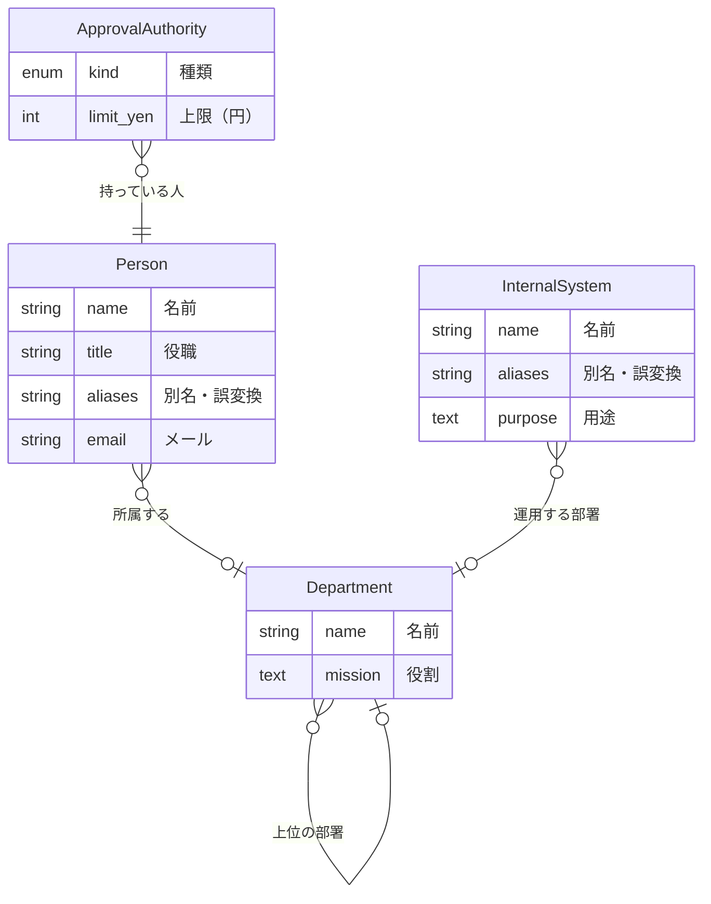

## 型

### ApprovalAuthority（決裁権限）

誰が、何の種類を、いくらまで決められるか。limit_yen が無ければ上限なし。

| 名前 | label | 型 | 必須 | 制約 |
|---|---|---|---|---|
| kind | 種類 | enum | ○ | 値: estimate/outsourcing/new_project |
| limit_yen | 上限（円） | int |  | min=0 |

### Department（部署）

| 名前 | label | 型 | 必須 | 制約 |
|---|---|---|---|---|
| name | 名前 | string | ○ | unique |
| mission | 役割 | text |  | - |

### InternalSystem（社内システム）

| 名前 | label | 型 | 必須 | 制約 |
|---|---|---|---|---|
| name | 名前 | string | ○ | unique |
| aliases | 別名・誤変換 | string |  | many |
| purpose | 用途 | text |  | - |

### Person（人）

| 名前 | label | 型 | 必須 | 制約 |
|---|---|---|---|---|
| name | 名前 | string | ○ | - |
| title | 役職 | string |  | - |
| aliases | 別名・誤変換 | string |  | many |
| email | メール | string |  | - |

## つながり

| 名前 | label | from → to | 件数 | 逆向き |
|---|---|---|---|---|
| belongs_to | 所属する | Person → Department | 0..1 | members（0..*） |
| held_by | 持っている人 | ApprovalAuthority → Person | 1..1 | authorities（0..*） |
| operated_by | 運用する部署 | InternalSystem → Department | 0..1 | systems（0..*） |
| parent_dept | 上位の部署 | Department → Department | 0..1 | sub_depts（0..*） |

## できること

### TransferPerson（異動させる）

人の所属する部署を付け替える。組織の事実を変える操作なので、必ず実行待ちに積まれ、人の承認で反映される。

| 引数 | label | 型 | 必須 | 制約 |
|---|---|---|---|---|
| person | 人 | Person の id | ○ | - |
| to | 異動先 | Department の id | ○ | - |

前提条件:
- `person.belongs_to is None or person.belongs_to.id != to.id` → {person.name} は既に {to.name} に所属している

承認: 必ず実行待ち

## 件数

| 型 | 件数 |
|---|---|
| ApprovalAuthority | 4 |
| Department | 4 |
| InternalSystem | 2 |
| Person | 4 |

