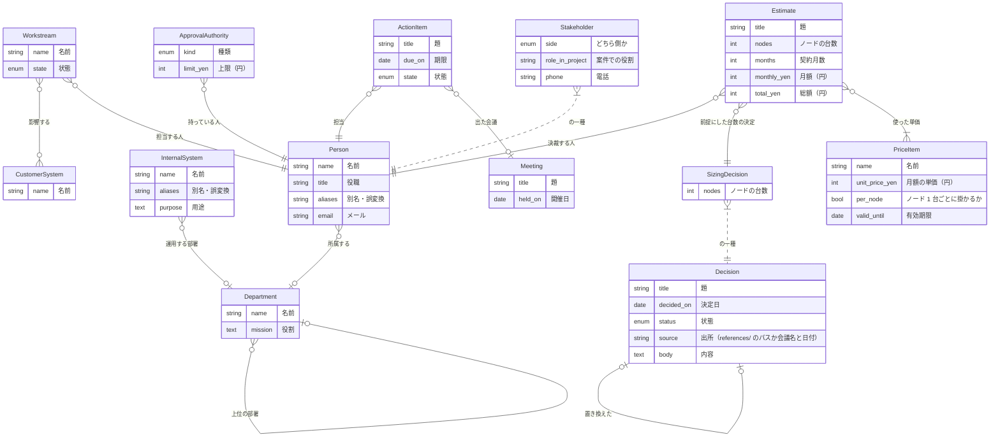

件数と中身は `scripts/ws onto types` / `query` で見る（このファイルは定義だけ）。

共通（自社）の型も使える: ApprovalAuthority・Department・InternalSystem・Person。定義は共通の `knowledges/ontology/index.md`。

## 型

### ActionItem（宿題）

| 名前 | label | 型 | 必須 | 制約 |
|---|---|---|---|---|
| title | 題 | string | ○ | - |
| due_on | 期限 | date |  | - |
| state | 状態 | enum | ○ | 値: open/done、default=open |

### CustomerSystem（顧客の業務システム）

| 名前 | label | 型 | 必須 | 制約 |
|---|---|---|---|---|
| name | 名前 | string | ○ | unique |

### Decision（決定）

会議などで決まったこと。置き換えられたら status が superseded になり、新しい決定から supersedes で指される。

| 名前 | label | 型 | 必須 | 制約 |
|---|---|---|---|---|
| title | 題 | string | ○ | - |
| decided_on | 決定日 | date | ○ | - |
| status | 状態 | enum | ○ | 値: active/superseded、default=active |
| source | 出所（references/ のパスか会議名と日付） | string | ○ | - |
| body | 内容 | text |  | - |

### Estimate（見積）

| 名前 | label | 型 | 必須 | 制約 |
|---|---|---|---|---|
| title | 題 | string | ○ | - |
| nodes | ノードの台数 | int | ○ | min=1 |
| months | 契約月数 | int | ○ | min=1 |
| monthly_yen | 月額（円） | int | ○ | min=0 |
| total_yen | 総額（円） | int | ○ | min=0 |

### Meeting（会議）

| 名前 | label | 型 | 必須 | 制約 |
|---|---|---|---|---|
| title | 題 | string | ○ | - |
| held_on | 開催日 | date | ○ | - |

### PriceItem（単価）

| 名前 | label | 型 | 必須 | 制約 |
|---|---|---|---|---|
| name | 名前 | string | ○ | - |
| unit_price_yen | 月額の単価（円） | int | ○ | min=0 |
| per_node | ノード 1 台ごとに掛かるか | bool | ○ | default=False |
| valid_until | 有効期限 | date |  | - |

### SizingDecision（台数の決定）

ノードの台数を決めた決定。見積はこれを前提にする。決定の一種。

| 名前 | label | 型 | 必須 | 制約 |
|---|---|---|---|---|
| title | 題 | string | ○ | - |
| decided_on | 決定日 | date | ○ | - |
| status | 状態 | enum | ○ | 値: active/superseded、default=active |
| source | 出所（references/ のパスか会議名と日付） | string | ○ | - |
| body | 内容 | text |  | - |
| nodes | ノードの台数 | int | ○ | min=1 |

### Stakeholder（案件の関係者）

顧客側・協力会社側の人。人の一種（自社の人は共通の Person に居る）。

| 名前 | label | 型 | 必須 | 制約 |
|---|---|---|---|---|
| name | 名前 | string | ○ | - |
| title | 役職 | string |  | - |
| aliases | 別名・誤変換 | string |  | many |
| email | メール | string |  | - |
| side | どちら側か | enum | ○ | 値: customer/partner |
| role_in_project | 案件での役割 | string |  | - |
| phone | 電話 | string |  | - |

### Workstream（作業領域）

| 名前 | label | 型 | 必須 | 制約 |
|---|---|---|---|---|
| name | 名前 | string | ○ | - |
| state | 状態 | enum | ○ | 値: not_started/in_progress/blocked/done、default=not_started |

## つながり

| 名前 | label | from → to | 件数 | 逆向き |
|---|---|---|---|---|
| affects | 影響する | Workstream → CustomerSystem | 0..* | affected_by（0..*） |
| approver | 決裁する人 | Estimate → Person | 1..1 | approves（0..*） |
| based_on | 前提にした台数の決定 | Estimate → SizingDecision | 1..1 | estimates（0..*） |
| lead | 担当する人 | Workstream → Person | 1..1 | leads（0..*） |
| owner | 担当 | ActionItem → Person | 1..1 | action_items（0..*） |
| priced_by | 使った単価 | Estimate → PriceItem | 1..* | used_in（0..*） |
| raised_in | 出た会議 | ActionItem → Meeting | 0..1 | raised_items（0..*） |
| supersedes | 置き換えた | Decision → Decision | 0..1 | superseded_by（0..1） |

## できること

### AddActionItem（宿題を足す）

会議などで出た宿題を、担当と期限つきで記録する。担当は必ず 1 人。

| 引数 | label | 型 | 必須 | 制約 |
|---|---|---|---|---|
| title | 題 | string | ○ | - |
| owner | 担当 | Person の id | ○ | - |
| due_on | 期限 | date |  | - |
| meeting | 出た会議 | Meeting の id |  | - |

承認: 自動

### CloseActionItem（宿題を完了にする）

宿題を完了にする。すでに完了しているものには使えない。

| 引数 | label | 型 | 必須 | 制約 |
|---|---|---|---|---|
| item | 宿題 | ActionItem の id | ○ | - |

前提条件:
- `item.state == 'open'` → すでに完了している

承認: 自動

### IssueEstimate（見積を出す）

現行の台数の決定と単価から見積を作る。月額と総額はエンジンが計算するので、自分で計算した数字を書かない。置き換え済みの決定・期限の切れた単価・見積の決裁権限が無い人では出せない。総額が決裁する人の上限を超えると実行待ちに積まれ、人の承認で反映される。

| 引数 | label | 型 | 必須 | 制約 |
|---|---|---|---|---|
| title | 題 | string | ○ | - |
| sizing | 前提にする台数の決定 | SizingDecision の id | ○ | - |
| items | 使う単価 | PriceItem の id | ○ | many |
| months | 契約月数 | int | ○ | min=1 |
| approver | 決裁する人 | Person の id | ○ | - |

前提条件:
- `sizing.status == 'active'` → 置き換え済みの決定（{sizing.title}・{sizing.nodes} 台）を前提にしている。現行の決定は {sizing.superseded_by.title}（{sizing.superseded_by.nodes} 台）
- `all(i.valid_until is None or days_since(i.valid_until) <= 0 for i in items)` → 有効期限の切れた単価が含まれている
- `any(a.kind == 'estimate' for a in approver.authorities)` → {approver.name} に見積の決裁権限が無い
- `months >= MIN_CONTRACT_MONTHS` → 契約月数は {MIN_CONTRACT_MONTHS} か月以上

承認: `not any(a.kind == 'estimate' and (a.limit_yen is None or est.total_yen <= a.limit_yen) for a in approver.authorities)` のとき実行待ち（担当: 上位の決裁者）

### RecordSizingDecision（台数の決定を記録する）

ノードの台数についての決定を記録する。前の決定を置き換えるなら supersedes に指定すると、前の決定は superseded になる。出所（会議名と日付か references/ のパス）が無い決定は記録できない。

| 引数 | label | 型 | 必須 | 制約 |
|---|---|---|---|---|
| title | 題 | string | ○ | - |
| nodes | ノードの台数 | int | ○ | min=1 |
| decided_on | 決定日 | date | ○ | - |
| source | 出所 | string | ○ | - |
| supersedes | 置き換える決定 | SizingDecision の id |  | - |

前提条件:
- `days_since(decided_on) >= 0` → 決定日が未来になっている
- `supersedes is None or supersedes.status == 'active'` → 置き換える決定（{supersedes.title}）は既に置き換え済み。現行の決定は {supersedes.superseded_by.title}

承認: 自動

